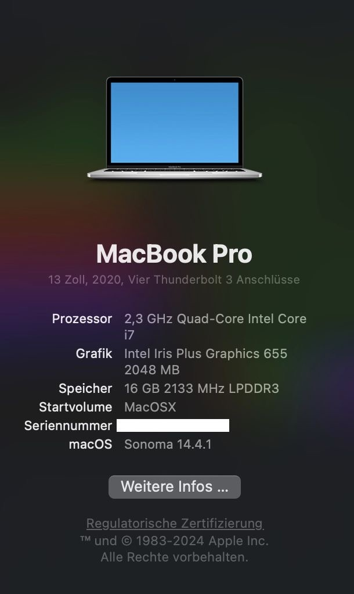

# ASUS-Zenbook-Flip-UX463-BigSur-OpenCore
This repo contains the files and scripts to install macOS on the ASUS Zenbook UX463 family

sysInfo | neoFetch
:---:|:----:
 | 

# Update History
- [x] macOS 14.4.1
- [x] macOS 14.1
- [x] macOS 11.7.5
- [x] macOS 11.6.5
- [x] macOS 11.6.4
- [x] macOS 11.2.1
- [x] macOS 11.2
- [x] macOS 11.1

# Laptop's Hardware
- <b>Model</b>: ASUS Zenbook UX463F
- <b>Bios</b>: 304
- <b>CPU</b>: Intel(R) Core(TM) i7-10510U CPU @ 1.80GHz
- <b>GPU</b>: Intel UHD Graphics 620
- <b>Storage</b>: 512GB M.2 NVMe™ PCIe® SSD with 32GB Intel® Optane™ Memory
- <b>RAM</b>: 16GB LPDDR3
- <b>Screen</b>: 14" FHD (1920x1080) IPS
- <b>Wi-Fi</b>: Intel Wireless-AC 9462
- <b>Ethernet</b>: Realtek RTL8153 Gigabit Ethernet Adapter
- <b>Sound</b>: Realtek ALC294
- <b>Camera</b>: USB2.0 HD IR UVC WebCam

# Bios settings

<b>Advanced</b>
- Fn lock Option - **Enabled** 
- Hyper-Threading - **Enabled**
- Intel Virtualization - **Enabled**
- Intel AES-NI - **Enabled**
- VT-d - **Enabled**
- Network Stack - **Disabled**
- USB Configuration - **Enabled**
- Graphics Configuration - **64M**
- Sata Mode - **AHCI**

<b>Boot</b>
- Fast Boot - **Disabled**

<b>Security</b>
- Secure Boot - **Disabled**

# What's Working?
- [x] Intel UHD Graphics 620 (incuding graphics acceleration)
- [x] CPU Power Management
- [x] Battery
- [x] All USB ports
- [x] HDMI port (including HDMI Audio)
- [x] Realtek RTL8153 Gigabit port
- [x] Realtek ALC294 Audio (including headphones jack & usb-c headsets)
- [x] Wi-Fi & Bluetooth (including Apple services)
- [x] Trackpad (with gestures)
- [x] Screenpad
- [x] Touchscreen (including Stylus, sometimes not working)
- [x] Sleep / Wake / Shutdown / Reboot (lid sleep and lid wake)
- [x] Keyboard (incuding FN Keys F1-F6)
- [x] iMessage, FaceTime, App Store, iTunes Store (with valid smbios)
- [x] DRM support (iTunes Movies, Apple TV+, Amazon Prime and Netflix, and others)
- [x] mini SD Card Reader

# What's not working ⚠️
- [ ] Sidecar Wireless (doesn't work without apple native WIFI card)
- [ ] Internal camera (There is no driver for this Camera available)
- [ ] Keyboard (FN Keys F8-F12)

# TODO
- [x] CPUTsync neu
- [ ] FN lock
- [ ] Sidecar testen
- [ ] Secureboot enable
- [x] Keyboard repeat rate
- [x] USB Ethernet Adapter
- [ ] Fancontrol? FN Key?
- [ ] Sleep / Hibernate
- [ ] Voltageshift usage /optimization
- [ ] Lidwake sleep / wakeup (Main screen resolution
- [ ] Keyboard wakeup (only usb working)
- [ ] Stylus not working
- [ ] sleep ejects sd card

